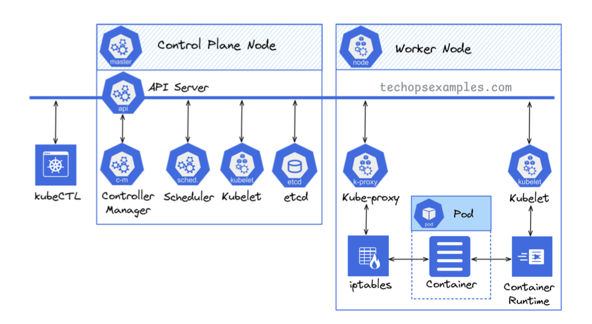

# Kubernetes Architecture - Easy Guide

## What is Kubernetes?
Kubernetes is a system that helps manage applications inside containers. It makes sure everything runs smoothly and can fix problems automatically.

## How Kubernetes Works
Kubernetes has two main parts:
1. **Control Plane (The Brain 🧠)** - Manages and controls everything.
2. **Worker Nodes (The Muscles 💪)** - Runs the applications.

## Control Plane (The Brain 🧠)
This part decides what should happen in the cluster.

### Main Parts:
- **API Server** – Like a receptionist, it receives commands and sends them to the right place.
- **Controller Manager** – Makes sure everything is as it should be. If something is missing, it fixes it.
- **Scheduler** – Finds the best worker node for new applications.
- **etcd** – A memory bank that stores all the important cluster data.
- **Kubelet** – Ensures everything in the control plane is running correctly.

## Worker Nodes (The Muscles 💪)
Worker nodes do the actual work of running applications.

### Main Parts:
- **Kubelet** – Makes sure applications (containers) are running properly.
- **Kube-proxy** – Helps applications talk to each other.
- **Container Runtime** – Runs the actual applications inside containers.
- **Pods & Containers** – A pod is a small unit that contains one or more containers running an application.

## How Everything Works Together 🏗️
1. The **Control Plane** makes decisions and manages the system.
2. The **Worker Nodes** run the applications and follow instructions.
3. Together, they keep applications running smoothly and automatically fix issues.

---

